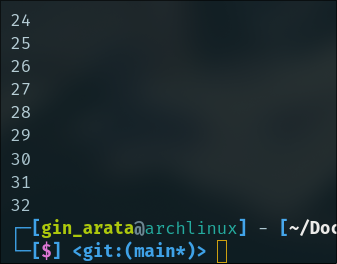

# Pertemuan 3 - Praktikum & Tugas

## Soal 1
Silakan selesaikan Praktikum 1 sampai 3, lalu dokumentasikan berupa screenshot hasil pekerjaan beserta penjelasannya!

- Praktikum 1 <br>

1.1. Silakan coba eksekusi (Run) kode pada langkah 1 tersebut. Apa yang terjadi? Jelaskan

Code : <br>
    <br>
Output : <br>
    <br>
Penjelasan :<br> 
Dari kode tersebut dart akan melakukan pengecekan apakah value dari variabel test yaitu "test 2" sesuai dengan if conditions-nya atau tidak jika sesuai dart akan melakukan print output berupa "Test2". Jika value merupakan "test 1" akan mengembalikan output "Test1". Jika value tidak cocok dengan seluruh if conditions akan mengembalikan output "Something else"

1.2 Tambahkan kode program berikut, lalu coba eksekusi (Run) kode Anda.
```
String test = "true";
if (test) {
   print("Kebenaran");
}
```
Apa yang terjadi ? Jika terjadi error, silakan perbaiki namun tetap menggunakan if/else.

Code Error :<br>
     <br>
Code Fixed : <br>
     <br>
Output : <br>
     <br>
Penjelasan : <br> Dari kode tersebut akan melakukan return output yaitu "Kebenaran" karena pada statement menggunakan "==" operator yang dimana akan melakukan pengecekan value dan tipe data jika pada dart.

- Praktikum 2 <br>

2.1 Silakan coba eksekusi (Run) kode pada langkah 1 tersebut. Apa yang terjadi? Jelaskan! Lalu perbaiki jika terjadi error.
```
while (counter < 33) {
  print(counter);
  counter++;
}
```

Code Error : <br> 
     <br>
Code Fixed : <br>
     <br>
Output : <br>
     <br>
Penjelasan : <br> Dari kode tersebut dart akan melakukan print value dari variabel counter sebanyak 33 kali. Ini bisa terjadi karena kita melakukan operasi while dan di dalam while terdapat conditions ```counter < 33``` dan ```counter++``` untuk menambahkan value pada variabel counter hingga batas conditions.

2.2 Tambahkan kode program berikut, lalu coba eksekusi (Run) kode Anda.
```
do {
  print(counter);
  counter++;
} while (counter < 77);
```
Apa yang terjadi ? Jika terjadi error, silakan perbaiki namun tetap menggunakan do-while.

Code : <br>
     <br>
Output : <br>
     <br>
Penjelasan : <br> Dari kode tersebut dart akan menjalankan do-while setidaknya sekali sebelum melakukan looping. Setelah itu dart akan melakukan looping hingga mencapai batas conditions pada while.

- Praktikum 3 <br>

3.1 Silakan coba eksekusi (Run) kode pada langkah 1 tersebut. Apa yang terjadi? Jelaskan! Lalu perbaiki jika terjadi error.
```
for (Index = 10; index < 27; index) {
  print(Index);
}
```

Code Error : <br>
     <br>
Code Fixed: <br>
     <br>
Output : <br>
     <br>
Penjelasan : <br>
Dari kode tersebut dart akan melakukan perulangan for dimulai dari value 0 hingga kurang dari 27 dan di setiap perulangan akan melakukan print index.

3.2 Tambahkan kode program berikut di dalam for-loop, lalu coba eksekusi (Run) kode Anda.
```
If (Index == 21) break;
Else If (index > 1 || index < 7) continue;
print(index);
```
Apa yang terjadi ? Jika terjadi error, silakan perbaiki namun tetap menggunakan for dan break-continue.

Code Error : <br>
     <br>
Code Fixed : <br>
     <br>
Output : <br>
     <br>
Penjelasan : <br>
Dari kode tersebut dart akan melakukan perulangan for hingga kurang dari 27. Dan ketika value dari variable index mencapai 21 dart akan melakukan break terhadap looping dan jika value variable index lebih dari 1 atau kurang dari 7 dart akan melakukan print index dan continue perulangan.

## Soal 2
Buatlah sebuah program yang dapat menampilkan bilangan prima dari angka 0 sampai 201 menggunakan Dart. Ketika bilangan prima ditemukan, maka tampilkan nama lengkap dan NIM Anda.

Jawaban : 

Code : 
```
void main() {
  for (int i = 2; i <= 201; i++) {
    bool isPrime = true;

    for (int j = 2; j <= i / 2; j++) {
      if (i % j == 0) {
        isPrime = false;
        break;
      }
    }

    if (isPrime) {
      print("Bilangan Prima: $i");
      print("Gaco Razan Kamil - 2241720091");
    }
  }
}
```

Output : 
```
Bilangan Prima: 193
Gaco Razan Kamil - 2241720091
Bilangan Prima: 195
Gaco Razan Kamil - 2241720091
Bilangan Prima: 197
Gaco Razan Kamil - 2241720091
Bilangan Prima: 199
Gaco Razan Kamil - 2241720091
Bilangan Prima: 201
Gaco Razan Kamil - 2241720091
```